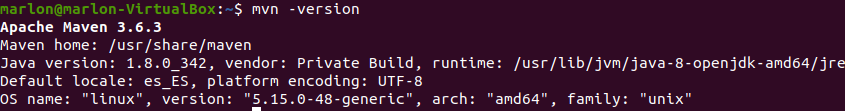
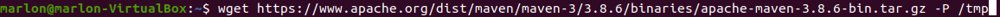
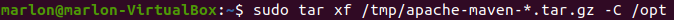
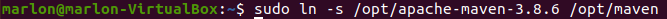
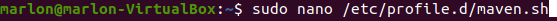
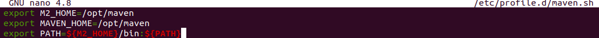
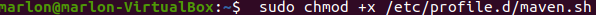
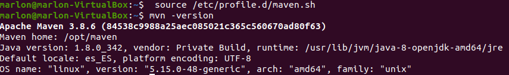

# Instalacion-de-Maven-en-el-SO

**Nombre:** Marlon Farizo Hergueta.

**Curso:** 1º Desarrollo de Aplicaciones Web.

**Asignatura:** Entornos de desarrollo.

### ÍNDICE

+ [Instalación de Maven](#id1)
+ [Instalación de una versión concreta](#id2)

### Instalación de Maven  

En primer lugar vamos a poner el comando para instalar el Maven y veremos su versión.

### Instalación de una versión concreta 

Empezaremos descargando e instalando la versión 3.8.6 de Maven.

Extraemos el archivo.

Hacemos un enlace simbólico para tener mas control sobre las versiones.

Creamos un archivo para establecer las variables de entorno

Hacemos ejecutable el script, cargamos las variables y vemos nuestra nueva versión

